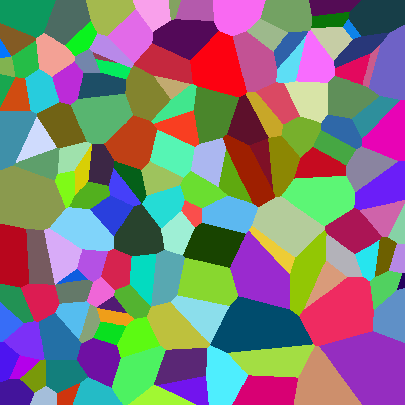

# 🚀 High-Performance Voronoi Diagram Generator in Rust 🦀

[](https://www.rust-lang.org)
[](https://opensource.org/licenses/MIT)

Generate beautiful and complex Voronoi diagrams with ease using this high-performance command-line tool written in Rust. It leverages parallelism with **Rayon** and efficient k-d tree lookups via **Kiddo** to deliver results quickly, even for large images and numerous sites.


*(Example output: `cargo run --sites 100 --seed 69`(nice!))*

## ✨ Features

*   **Voronoi Diagram Generation**: Creates Voronoi diagrams based on a set of random sites.
*   **Customizable Output**:
    *   Control image dimensions (width, height).
    *   Specify the number of generating sites.
    *   Set a random seed for reproducible results.
    *   Define output filename prefix and image format (e.g., PNG, JPG).
*   **High Performance**:
    *   **Parallel Pixel Calculation**: Utilizes Rayon to compute pixel colors in parallel across multiple CPU cores.
    *   **Efficient Nearest Neighbor Search**: Employs a k-d tree (via the Kiddo crate) for fast identification of the closest site to each pixel.
*   **User-Friendly CLI**: Powered by Clap for easy-to-use command-line arguments.
*   **Clean Code Structure**: Modular design with logic separated into a library (`lib.rs`) and a binary (`main.rs`).
*   **Type Safety**: Benefits from Rust's strong type system and memory safety.

## 🛠️ Tech Stack & Key Crates

*   **Rust**: Core programming language.
*   **`rayon`**: For data parallelism, speeding up pixel computation.
*   **`kiddo`**: For k-d tree implementation, enabling efficient nearest neighbor searches.
*   **`image`**: For image processing and saving the generated diagram.
*   **`clap`**: For parsing command-line arguments.
*   **`fastrand`**: For fast random number generation.

## ⚙️ How It Works - The Algorithm

1.  **Site Generation**: A specified number of `Site` objects are randomly generated within the image dimensions. Each site consists of a `Point` (x, y coordinates) and a `Color` (RGB).
2.  **K-D Tree Construction**: The (x, y) coordinates of these sites are used to build an immutable k-d tree. This data structure allows for very efficient querying of the nearest site to any given point.
3.  **Pixel-by-Pixel Coloring (Parallelized)**:
    *   The program iterates over every pixel in the target image.
    *   For each pixel, its (x, y) coordinates are used to query the k-d tree to find the `Site` whose `Point` is closest to the pixel's location (using squared Euclidean distance).
    *   The pixel is then assigned the `Color` of this nearest `Site`.
    *   This entire process is parallelized row by row using `rayon`.
4.  **Image Saving**: The resulting 2D array of pixel colors is saved to an image file using the `image` crate.

## 📋 Prerequisites

*   Rust toolchain (e.g., version 1.70+). Install from [rustup.rs](https://rustup.rs/).

## 🚀 Getting Started

1.  **Clone the repository:**
    ```bash
    git clone https://github.com/abishekdevendran/voronoi-rust
    cd voronoi-rust
    ```

2.  **Build the project:**
    ```bash
    cargo build --release
    ```
    *(Using `--release` flag is recommended for performance-critical applications like this.)*

3.  **Run the generator:**

    *   **With default settings:**
        ```bash
        cargo run --release
        ```
        This will generate an `output_voronoi_42.png` file (800x800, 50 sites, seed 42).

    *   **With custom arguments:**
        ```bash
        cargo run --release --width 1200 --height 900 --sites 250 --seed 123 --prefix my_diagram_ --format jpg
        ```
        This will generate `my_diagram_123.jpg` with specified dimensions and site count.

    *   **View help for all options:**
        ```bash
        cargo run --release --help
        ```

        ```
        Voronoi Diagram Generator

        Usage: voronoi-rust [OPTIONS]

        Options:
              --width <WIDTH>          [default: 800]
              --height <HEIGHT>        [default: 800]
          -c, --sites <SITES>          [default: 50]
          -s, --seed <SEED>            [default: 42]
          -p, --prefix <PREFIX>        [default: output_voronoi_]
          -f, --format <FORMAT>        [default: png]
          -h, --help                   Print help
          -V, --version                Print version
        ```

## 🏗️ Code Structure

*   `src/lib.rs`: Contains the core logic for the Voronoi diagram generation:
    *   Data structures (`Point`, `Color`, `Site`).
    *   Site generation function (`generate_sites`).
    *   K-D tree building function (`build_kdtree_from_sites`).
    *   Pixel data generation (`generate_voronoi_pixels`).
    *   Image saving utility (`save_pixels_to_image`).
*   `src/main.rs`: Handles command-line argument parsing (using `clap`) and orchestrates the steps of generating and saving the Voronoi diagram.

## 💡 Potential Future Enhancements

*   Implement different distance metrics (e.g., Manhattan distance).
*   Add support for weighted Voronoi diagrams.
*   Incorporate Lloyd's relaxation algorithm for more evenly distributed sites.
*   Explore different color generation strategies for sites.
*   Add options for drawing site points or cell boundaries.
*   Benchmarking suite to precisely measure performance gains.

## 🤝 Contributing

Contributions, issues, and feature requests are welcome! Feel free to check [issues page](<your-repo-url>/issues) if you want to contribute.

## 📄 License

This project is licensed under the MIT License - see the [LICENSE.md](LICENSE.md) file for details (you'll need to create this file with the MIT license text).